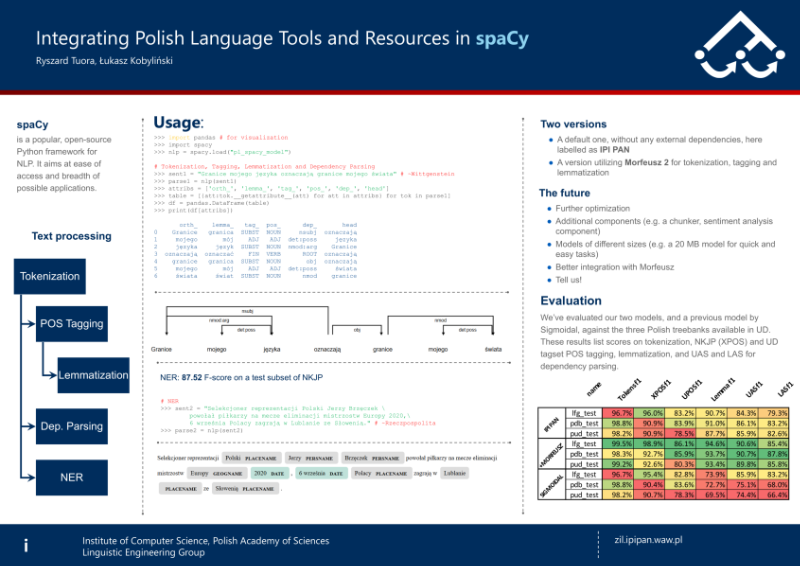

# spaCy: Polish language pipeline and models

## Where to get it
The latest version of the model is available here: [http://zil.ipipan.waw.pl/SpacyPL](http://zil.ipipan.waw.pl/SpacyPL)

## Requirements
Spacy in a version `>= 2.2`.

## Installation
First, you need to install spaCy (we need versions `>= 2.2`). Please refer to the [official documentation](https://spacy.io/usage) to do so.

For example, using Anaconda:

```bash
conda install -c conda-forge spacy
```

Then, after downloading the package, install it as any other python module: 

```bash
python -m pip install PATH/TO/pl_spacy_model-x.x.x.tar.gz
```

If you can install the [Morfeusz 2](http://morfeusz.sgjp.pl/download/en) bindings for Python, we reccomend using the `pl_spacy_model_morfeusz` version of our model, which is superior in performance. For details, please see the __pl_spacy_model_morfeusz__ section below.

```bash
python -m pip install PATH/TO/pl_spacy_model_morfeusz-x.x.x.tar.gz
```

## Quick start

```python
import spacy
nlp = spacy.load('pl_spacy_model') # or spacy.load('pl_spacy_model_morfeusz')

# List the tokens including their lemmas and POS tags
doc = nlp("Granice mojego języka oznaczają granice mojego świata") # ~Wittgenstein
for token in doc:
    print(token.text, token.lemma_, token.tag_)
```

## A more complete example
Please see this [Jupyter notebook](https://nbviewer.jupyter.org/github/ipipan/spacy-pl/blob/master/spaCy-PL-demo.ipynb)

or this [poster](poster.pdf) and [presentation](presentation.pdf).

## What is included?

### Lemmatizer
The lemmatizer is implemented as a look-up table, using a lemma dictionary imported from the [Morfeusz morphological analyzer](http://morfeusz.sgjp.pl/).

### Tagger
The tagger has been trained on a corpus consisting of the 1 million word subcurpous of the [National Corpus of Polish](http://clip.ipipan.waw.pl/NationalCorpusOfPolish} and the 500k [Frequency Corpus of the 1960s Polish language](http://clip.ipipan.waw.pl/PL196x). For tasks involving Polish language only, we reccomend using the internal tagset (`token.tag_` as opposed to `token.pos_`), because the latter is a lossy mapping of the former.

### Depenendency Parser
For training a dependency parser, we've used the [PDB UD treebank](https://universaldependencies.org/treebanks/pl_pdb/index.html)

### Named Entity Recognizer
NER model has been trained on the 1 million word subcurpous of the [National Corpus of Polish](http://clip.ipipan.waw.pl/NationalCorpusOfPolish). 

### Word embeddings
Word embeddings trained on KGR10 corpus (over 4 billion of words) using Fasttext by Jan Kocoń and Michał Gawor (https://clarin-pl.eu/dspace/handle/11321/606). Our model uses only the vector representation for 800.000 most frequent words.

Please see this [Jupyter notebook](https://nbviewer.jupyter.org/github/ipipan/spacy-pl/blob/master/spaCy-PL-embeddings.ipynb) for a demo.

## pl_spacy_model_morfeusz
This version of our model utilizes an external dependency: Morfeusz 2. We reccomend using this version, as it is significantly better for all the tasks involved. To do so you need to first install the Morfeusz 2 library, and its embeddings for Python. The detailed instructions for your architecture are available [here](http://morfeusz.sgjp.pl/download/en): Morfeusz 2 bindings are installed via easy_install, and not via pip, although we are discussing the option to switch onto pip into the future. If Morfeusz 2 is not installed correctly, you will see a warning message and the model will not work as expected.

Morfeusz 2 is used within our custom pipeline component called Preprocessor. The Preprocessor first tokenizes the text, and then performs morphosyntactic analysis, and lemmatization. Since Morfeusz 2 offers multiple analyses for each token, we disambiguate these using an ordinary spaCy tagger. Because of this there is no separate tagger component in our pipeline (although there is a tagger in the model), and you cannot skip tagging during the processing stage.

In this version of the model, the `token.tag_` attribute returns an extended tag, instead of a POS tag only. Because of contextual ambiguity, there are usually mutiple analyses, and the extended tag consists only of those features, on which all analyses agree. For example 'kotką' will return _'SUBSG:sg:inst:f'_, 'kota' will yield _'SUBST:sg'_ while 'koteczek' will yield _'SUBST'_ only. You can obtain the POS tag by splitting on colons (`pos = token.tag_.split(':')[0]`) and the UPOS tag by `token.pos_` attribute.

This [notebook](https://nbviewer.jupyter.org/github/ipipan/spacy-pl/blob/master/spaCy_PL_morfeusz_demo.ipynb) shows some features of the model with Morfeusz 2.

## Evaluation metrics
Both the poster and the article list the evaluation scores for 0.0.3 version, for up to date results please see the `evaluation` folder.

## Change history
 * 0.0.5 -- several changes
   * corrected errors in NER model,
   * parser now performs sentencization correctly (you can parse whole documents now, instead of individual sentences)
   * parser trained on PDB treebank (instead of LFG),
   * added version using Morfeusz library as an external dependency; more detailed morphosyntactic tags are available in token.tag_ attribute.
 * 0.0.3 -- added support for spaCy 2.2

## Authors
Ryszard Tuora

supervision: Łukasz Kobyliński

## Citing
Ryszard Tuora and Łukasz Kobyliński, "Integrating Polish Language Tools and Resources in spaCy". In: Proceedings of PP-RAI'2019 Conference, 16-18.10.2019, Wrocław, Poland.

[](poster.pdf)
